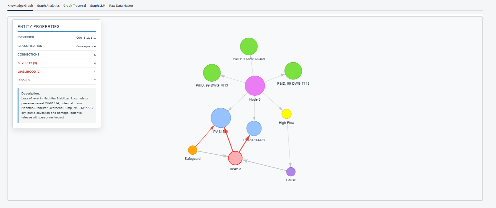
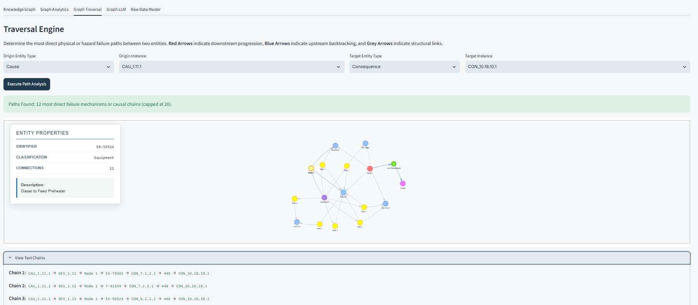

# Process Safety Management (PSM) Knowledge Graph & RAG Architecture
---
*Disclaimer: The datasets provided herein have been strictly anonymized and sanitized. No proprietary corporate data, actual process configurations, or live asset tags are present within the repository.*


**Demo:** https://psm-knowlege-graph-db.streamlit.app/ 

This repository demonstrates an end-to-end data engineering, Natural Language Processing (NLP), and Graph Retrieval-Augmented Generation (GraphRAG) architecture tailored for industrial Process Safety Management (PSM). 
It ingests highly unstructured engineering documentation (Process Hazard Analyses, Alarm Registers, and P&IDs), extracts latent topological and causal relationships, and constructs a queryable, deterministic Process Knowledge Graph. A localized LLM agent interfaces with this graph to provide hallucination-free querying of plant physics and safety systems.

## System Previews





## Dataset Metrics (Demonstration Sample)
The anonymized sample datasets provided in this repository have been fully processed by the pipeline, yielding the following deterministic engineering metrics:

### Topological Process Graph (`PSM_Master_Inputs.graphml`)
- **Total Topological Entities (Nodes):** 3,584
- **Causal & Physical Relationships (Edges):** 6,826
- **Unique Process Equipment Mapped:** 219
- **Unique Hazard Scenarios (Causes/Consequences):** 2,685
- **Safety Instrumented Functions (SIFs) & Safeguards:** 481

### Automated Gap Analysis (`PSM_Master_Inputs.db`)
- **Total Safeguards Audited Against Alarm Register:** 372
- **Successfully Aligned (PHA matches Alarm Config):** 191
- **Critical Mismatches (PHA Severity=4/5 vs Low Priority Alarm):** 43
- **Under-Rationalized Alarms:** 13

## Technical Architecture

### 1. Data Ingestion & NLP Extraction Pipeline (`pipeline/`)
The backend pipeline executes sequential ETL operations using Python, Pandas, and specialized NLP libraries to structure raw text into a relational schema:
- **`pha_study_flattener.py`:** Extracts core process node specifications using compiled Regular Expressions (Regex) over tabular subsets.
- **`hazop_flattener.py`:** Parses unstructured HAZOP matrices. Employs `rapidfuzz` (Fuzzy String Matching) via Levenshtein distance metrics to map human-written causal text to definitive equipment tags.
- **`sif_parser.py` & `alarms_parser.py`:** Utilizes `sentence-transformers` (`all-MiniLM-L6-v2`) to generate dense vector embeddings of safety text. It applies cosine similarity thresholds to isolate definitive Safety Instrumented Functions (SIFs) and process alarms from generic instrumentation.
- **`gap_analyzer.py`:** Computes cross-document integrity. Uses TF-IDF vectorization to perform automated semantic gap analysis, mathematically validating that PHA-mandated risk severities align with configured alarm priorities.

### 2. Graph Construction & RDB Output
- **Relational Backend:** `rdb_builder.py` persists normalized data into a lightweight `SQLite` database (`PSM_Master_Inputs.db`).
- **Knowledge Graph Backend:** `graphdb_builder.py` utilizes `NetworkX` to construct a directed multigraph (`PSM_Master_Inputs.graphml`). Assets (Valves, Transmitters) and abstract concepts (Deviations, Causes, Safeguards) are mapped as nodes, with causal propagations represented as directed edges conforming to a strict Bowtie methodology constraint.

### 3. Frontend Visualization & GraphRAG Copilot
The presentation layer is deployed via `Streamlit`, interfacing directly with the `.db` and `.graphml` local instances:
- **Topological Traversal:** Implements `PyVis` for interactive force-directed graph rendering. Exposes shortest-path routing algorithms (`nx.all_shortest_paths`) to trace unmitigated failure propagations downstream or backtrack causal chains upstream.
- **GraphRAG Subsystem:** Integrates a local Large Language Model via `Ollama` (`llama3.2`). User queries trigger deterministic subgraph extraction based on entity mentions (Regex/Fuzzy matches). The extracted semantic network topology is injected into the LLM context window, enforcing zero-shot grounded responses strictly bounded by the physical plant architecture.

## Deployment & Execution

This architecture is optimized for local execution to ensure absolute data privacy regarding proprietary engineering schematics.

### Prerequisites
- Python 3.9+
- Ollama runtime environment (`llama3.2` model instance active)

### Installation
```bash
git clone https://github.com/yuvipaloozie/PSM-Knowledge-Graph.git
cd PSM-Knowledge-Graph
pip install -r requirements.txt
ollama run llama3.2
```

### Execution
The repository provisions two discrete presentation layers:

**Graph Visualization & AI Copilot:**
```bash
streamlit run appGraph.py
```

**Relational Explorer & Gap Analysis:**
```bash
streamlit run app.py
```


